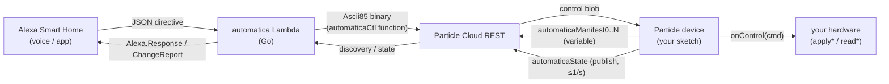
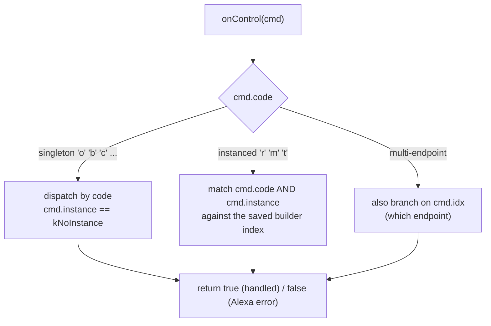

# Particle examples

This directory holds the runnable firmware examples for the **automatica** Particle library.
Each subfolder is one self-contained sketch (`<name>/<name>.ino`) for a single device
archetype. Every sketch begins with a header comment that names the archetype, lists the
exact Alexa capabilities it exposes (capability code + Alexa interface + singleton/instanced),
the precise utterances it enables, the hardware-wiring assumptions, and the gotchas.

There are **38 examples**. They are templates: copy one, replace the `apply*`/`read*` stubs
with your hardware, flash, and your device speaks Alexa Smart Home with no JSON, HTTP, or
OAuth on the MCU.

See also:

- [`../README.md`](../README.md) — library overview, install, capability reference, gotchas.
- [`../../../docs/product/particle-library-guide.md`](../../../docs/product/particle-library-guide.md) — the LLM-facing library guide.
- [`../../../docs/product/capabilities.md`](../../../docs/product/capabilities.md) — capability catalog.
- [`../../../contract/SPEC.md`](../../../contract/SPEC.md) — the authoritative v2 wire contract (binary layout, Ascii85, enum tables, capability codes).

---

## How an example reaches Alexa

Every sketch declares endpoints + capabilities, registers one control callback, and calls
`begin()`/`loop()`. The device exposes exactly three Particle Cloud primitives; the
self-hosted automatica Lambda is the only party that ever produces Alexa JSON.



| Surface | Particle primitive | Purpose |
|---|---|---|
| `automaticaManifest0..N` | `Particle.variable` (string) | Paged binary discovery manifest (Ascii85). |
| `automaticaCtl` | `Particle.function` → `int` | Control command (Ascii85 binary); returns `0` or a negative `CtlStatus`. |
| `automaticaState` | `Particle.publish` (PRIVATE) | Coalesced, latest-wins state changes (Ascii85 binary), ≤1/sec. |

Generic Logger records use a separate webhook bridge example:
[`logger-ingest/`](logger-ingest/). It publishes a Particle event such as
`logger/temperature/sensor-01`; configure a Particle webhook to POST that event
to the Logger HTTP API. This is not native AWS IoT MQTT.

---

## Build & flash any example

The library registry id is lowercase `automatica`. Pick a folder, then compile and flash it
to your device. Substitute your platform (`photon`, `photon2`, `p2`, `boron`, `argon`, …)
and your device name.

### Particle CLI

```sh
# From this examples/ directory, compile one example folder for your platform:
particle compile boron ./color-light --saveTo firmware.bin

# Flash it to your device (OTA over Particle Cloud):
particle flash <device-name> firmware.bin

# Or compile + flash in one step (cloud build):
particle flash <device-name> ./color-light
```

`./color-light` compiles `color-light/color-light.ino` together with the library `src/`.
The library is resolved from `library.properties` (`name=automatica`). Examples that drive an
RGB pixel (e.g. `color-light/`) pull `dependencies.neopixel=1.0.4`; the core itself has no
external dependency.

### Particle Workbench (VS Code)

Open the repository as a Particle project, select the example `.ino`, choose your device and
platform, then run **Particle: Cloud Flash** (or **Particle: Compile**). Workbench reads
`library.properties` and treats `src/` as the library automatically.

> Endpoint declaration order is the device identity — the array index *is* the Alexa idx and
> must stay stable across reboots. Each endpoint `id` must match `^[a-z0-9_-]{1,24}$`.

---

## Example catalog (all 38 examples, alphabetical)

| Example | Capabilities | One-liner |
|---|---|---|
| [`addressable-led/`](addressable-led/) | LCL pipeline | Full LCL v4 decode → StripEngine → WS2812 output with power clamp and digest reporting. |
| [`av-input/`](av-input/) | `o` + `j` | InputController: select AV input by index (HDMI 1, HDMI 2, …). |
| [`camera/`](camera/) | `C` | Stateless CameraStreamController; the Lambda renders the snapshot `imageUri`. |
| [`ceiling-fan/`](ceiling-fan/) | `o` + `r` + `t` + `m` | Canonical instanced example: power + speed + oscillate + direction. |
| [`channel-tv/`](channel-tv/) | `o` + `f` | ChannelController: change channel (absolute) / skip channels (signed). |
| [`color-light/`](color-light/) | `o` + `b` + `c` | RGB color light; color carries hue+sat, brightness stays on shared `b`. |
| [`crash-report/`](crash-report/) | CrashReporter | Detects panic/watchdog/brownout resets and publishes a one-shot crash record via Particle event. |
| [`curtain/`](curtain/) | `r` (+ semantics) | `CURTAIN` position with open/close semantics. |
| [`deep-sleep-sensor/`](deep-sleep-sensor/) | `e` + `n` + PowerManager | Battery climate sensor: wake, report temp/humidity + battery vitals, deep-sleep. |
| [`device-vitals/`](device-vitals/) | vitals event | Periodic heap/RSSI/uptime/reset vitals published as a Particle event for fleet monitoring. |
| [`dimmable-light/`](dimmable-light/) | `o` + `b` | On/off plus brightness (0–100). |
| [`door-lock/`](door-lock/) | `l` | LockController lock/unlock with state read-back. |
| [`doorbell/`](doorbell/) | `z` + `x` | Proactive DoorbellEventSource + EventDetectionSensor (fires a DoorbellPress). |
| [`equalizer-soundbar/`](equalizer-soundbar/) | `o` + `q` | EqualizerController: bass/mid/treble bands plus preset modes. |
| [`garage-door/`](garage-door/) | `m` (+ semantics) | Garage opener as an instanced ModeController with Open/Close semantics + PIN. |
| [`humidity-sensor/`](humidity-sensor/) | `n` | Read-only humidity as a RangeController percent (0–100). |
| [`hvac-thermostat/`](hvac-thermostat/) | `h` + `m` + `t` + `e` | Full HVAC: thermostat with ECO, plus instanced fan mode and aux-heat toggle. |
| [`ir-blaster/`](ir-blaster/) | AutomaticaIR | Record IR signals from any remote; replay single/repeat/sequence; chunked transfer for long frames. |
| [`logger-ingest/`](logger-ingest/) | Particle event webhook | Publishes `logger/<project>/<device>` events; configure a webhook to POST to the Logger HTTP API. |
| [`media-player/`](media-player/) | `y` + `u` | Transport ops (play/pause/stop/next/…) plus volume + mute. |
| [`motion-sensor/`](motion-sensor/) | `v` | Read-only MotionSensor (detected / not detected). |
| [`multi-endpoint/`](multi-endpoint/) | mixed | One MCU exposing several Alexa endpoints; routes directives by `cmd.idx`. |
| [`outbound-webhook/`](outbound-webhook/) | OutboundRules | On-device rules engine: POST projected state JSON to an OAuth2-protected external API on state change. |
| [`percentage-dimmer/`](percentage-dimmer/) | `o` + `p` | Generic PercentageController 0–100 (not a light-specific brightness). |
| [`power-level/`](power-level/) | `o` + `w` | PowerLevelController 0–100 (e.g. a heater element). |
| [`roller-blind/`](roller-blind/) | `r` (+ semantics) | Position 0–100 with open/close/raise/lower semantics. |
| [`scene-controller/`](scene-controller/) | `s` | Momentary SceneController (Activate/Deactivate). |
| [`security-panel/`](security-panel/) | `a` | SecurityPanelController arm/disarm (DISARMED / ARMED_AWAY / ARMED_STAY / ARMED_NIGHT). |
| [`sensor-fusion/`](sensor-fusion/) | `e` + `n` | Two-channel environmental node using `SensorPipeline` (calibration, EMA smoothing, deadband, Ledger config). |
| [`smart-plug/`](smart-plug/) | `o` | On/off plug/outlet (`SMARTPLUG`/`OUTLET`). |
| [`smart-switch/`](smart-switch/) | `o` | On/off wall switch (`SWITCH` display category). |
| [`speaker/`](speaker/) | `u` | Absolute volume (0–100) + mute. |
| [`step-speaker/`](step-speaker/) | `o` + `g` | Relative, momentary volume steps + mute (e.g. an IR receiver). |
| [`temperature-sensor/`](temperature-sensor/) | `e` | Read-only TemperatureSensor reporting via `reportState()`. |
| [`thermostat/`](thermostat/) | `h` + `e` | Setpoint + mode (HEAT/COOL/AUTO/OFF) with a current-temperature read-back. |
| [`time-hold/`](time-hold/) | `o` + `i` | TimeHoldController: momentary Hold/Resume (e.g. pause/resume a washer). |
| [`tunable-white-light/`](tunable-white-light/) | `o` + `b` + `k` | White light with color temperature in Kelvin (1000–10000). |
| [`window-sensor/`](window-sensor/) | `d` | Read-only ContactSensor (open/closed) via `reportState()`. |

---

## Cross-platform parity matrix

This table maps every archetype to its availability on Particle and ESP32. The camera
archetype is named `camera` on Particle and `camera-snapshot` on ESP32 — same capability,
different name.

| Archetype | Particle | ESP32 | Notes |
|---|---|---|---|
| addressable-led | [`addressable-led/`](addressable-led/) | [`addressable-led/`](../../esp32/automatica/examples/addressable-led/) | Both |
| av-input | [`av-input/`](av-input/) | [`av-input/`](../../esp32/automatica/examples/av-input/) | Both |
| camera / camera-snapshot | [`camera/`](camera/) | [`camera-snapshot/`](../../esp32/automatica/examples/camera-snapshot/) | Both — name differs between platforms |
| ceiling-fan | [`ceiling-fan/`](ceiling-fan/) | [`ceiling-fan/`](../../esp32/automatica/examples/ceiling-fan/) | Both |
| channel-tv | [`channel-tv/`](channel-tv/) | [`channel-tv/`](../../esp32/automatica/examples/channel-tv/) | Both |
| color-light | [`color-light/`](color-light/) | [`color-light/`](../../esp32/automatica/examples/color-light/) | Both |
| crash-report | [`crash-report/`](crash-report/) | [`crash-report/`](../../esp32/automatica/examples/crash-report/) | Both |
| curtain | [`curtain/`](curtain/) | [`curtain/`](../../esp32/automatica/examples/curtain/) | Both |
| deep-sleep-sensor | [`deep-sleep-sensor/`](deep-sleep-sensor/) | [`deep-sleep-sensor/`](../../esp32/automatica/examples/deep-sleep-sensor/) | Both |
| device-vitals | [`device-vitals/`](device-vitals/) | [`device-vitals/`](../../esp32/automatica/examples/device-vitals/) | Both |
| dimmable-light | [`dimmable-light/`](dimmable-light/) | [`dimmable-light/`](../../esp32/automatica/examples/dimmable-light/) | Both |
| door-lock | [`door-lock/`](door-lock/) | [`door-lock/`](../../esp32/automatica/examples/door-lock/) | Both |
| doorbell | [`doorbell/`](doorbell/) | [`doorbell/`](../../esp32/automatica/examples/doorbell/) | Both |
| equalizer-soundbar | [`equalizer-soundbar/`](equalizer-soundbar/) | [`equalizer-soundbar/`](../../esp32/automatica/examples/equalizer-soundbar/) | Both |
| garage-door | [`garage-door/`](garage-door/) | [`garage-door/`](../../esp32/automatica/examples/garage-door/) | Both |
| humidity-sensor | [`humidity-sensor/`](humidity-sensor/) | [`humidity-sensor/`](../../esp32/automatica/examples/humidity-sensor/) | Both |
| hvac-thermostat | [`hvac-thermostat/`](hvac-thermostat/) | [`hvac-thermostat/`](../../esp32/automatica/examples/hvac-thermostat/) | Both |
| logger-ingest | [`logger-ingest/`](logger-ingest/) | [`logger-ingest/`](../../esp32/automatica/examples/logger-ingest/) | Both (Particle: webhook bridge; ESP32: native MQTT ingest) |
| media-player | [`media-player/`](media-player/) | [`media-player/`](../../esp32/automatica/examples/media-player/) | Both |
| motion-sensor | [`motion-sensor/`](motion-sensor/) | [`motion-sensor/`](../../esp32/automatica/examples/motion-sensor/) | Both |
| multi-endpoint | [`multi-endpoint/`](multi-endpoint/) | [`multi-endpoint/`](../../esp32/automatica/examples/multi-endpoint/) | Both |
| outbound-webhook | [`outbound-webhook/`](outbound-webhook/) | [`outbound-webhook/`](../../esp32/automatica/examples/outbound-webhook/) | Both |
| percentage-dimmer | [`percentage-dimmer/`](percentage-dimmer/) | [`percentage-dimmer/`](../../esp32/automatica/examples/percentage-dimmer/) | Both |
| power-level | [`power-level/`](power-level/) | [`power-level/`](../../esp32/automatica/examples/power-level/) | Both |
| roller-blind | [`roller-blind/`](roller-blind/) | [`roller-blind/`](../../esp32/automatica/examples/roller-blind/) | Both |
| scene-controller | [`scene-controller/`](scene-controller/) | [`scene-controller/`](../../esp32/automatica/examples/scene-controller/) | Both |
| security-panel | [`security-panel/`](security-panel/) | [`security-panel/`](../../esp32/automatica/examples/security-panel/) | Both |
| sensor-fusion | [`sensor-fusion/`](sensor-fusion/) | [`sensor-fusion/`](../../esp32/automatica/examples/sensor-fusion/) | Both |
| smart-plug | [`smart-plug/`](smart-plug/) | [`smart-plug/`](../../esp32/automatica/examples/smart-plug/) | Both |
| smart-switch | [`smart-switch/`](smart-switch/) | [`smart-switch/`](../../esp32/automatica/examples/smart-switch/) | Both |
| speaker | [`speaker/`](speaker/) | [`speaker/`](../../esp32/automatica/examples/speaker/) | Both |
| step-speaker | [`step-speaker/`](step-speaker/) | [`step-speaker/`](../../esp32/automatica/examples/step-speaker/) | Both |
| temperature-sensor | [`temperature-sensor/`](temperature-sensor/) | [`temperature-sensor/`](../../esp32/automatica/examples/temperature-sensor/) | Both |
| thermostat | [`thermostat/`](thermostat/) | [`thermostat/`](../../esp32/automatica/examples/thermostat/) | Both |
| time-hold | [`time-hold/`](time-hold/) | [`time-hold/`](../../esp32/automatica/examples/time-hold/) | Both |
| tunable-white-light | [`tunable-white-light/`](tunable-white-light/) | [`tunable-white-light/`](../../esp32/automatica/examples/tunable-white-light/) | Both |
| window-sensor | [`window-sensor/`](window-sensor/) | [`window-sensor/`](../../esp32/automatica/examples/window-sensor/) | Both |
| ir-blaster | [`ir-blaster/`](ir-blaster/) | — | **Particle-only.** `AutomaticaIR` is a Particle-specific class; no ESP32 IR class is in scope. |
| ble-provisioning | — | [`ble-provisioning/`](../../esp32/automatica/examples/ble-provisioning/) | **ESP32-only.** BLE GATT provisioning; Particle uses its own cloud claiming flow. |
| captive-portal | — | [`captive-portal/`](../../esp32/automatica/examples/captive-portal/) | **ESP32-only.** SoftAP captive-portal for WiFi/Fleet-Provisioning onboarding; no Particle analog. |
| lcl-decoder | — | [`lcl-decoder/`](../../esp32/automatica/examples/lcl-decoder/) | **ESP32-only.** Decoder-only LCL verification demo; Particle uses the automaticaCtl/Ascii85 contract instead. |
| ota-demo | — | [`ota-demo/`](../../esp32/automatica/examples/ota-demo/) | **ESP32-only.** Signed A/B OTA via IoT Jobs; Particle OTA is built-in/automatic (not a missing example). |
| provisioning-demo | — | [`provisioning-demo/`](../../esp32/automatica/examples/provisioning-demo/) | **ESP32-only.** Serial + Fleet Provisioning by claim; Particle uses its own cloud claiming flow. |
| remote-logging | — | [`remote-logging/`](../../esp32/automatica/examples/remote-logging/) | **ESP32-only.** Structured per-device log drain to MQTT; covered on Particle by the existing logger-ingest example. |
| shadow-cache | — | [`shadow-cache/`](../../esp32/automatica/examples/shadow-cache/) | **ESP32-only.** AWS IoT Device Shadow for durable desired/reported state; Particle uses cloud variables instead. |
| taudio-portal | — | [`taudio-portal/`](../../esp32/automatica/examples/taudio-portal/) | **ESP32-only.** LilyGO T-Audio board-specific demo (SoftAP + captive-portal + color-light). |
| tcamera-demo | — | [`tcamera-demo/`](../../esp32/automatica/examples/tcamera-demo/) | **ESP32-only.** LilyGO T-Camera board-specific demo (PIR + OLED + two endpoints). |

---

## Examples by capability

Capability codes (`o`, `b`, `r`, …) are defined in [`../../../contract/SPEC.md`](../../../contract/SPEC.md)
and tabulated in [`../README.md`](../README.md#capability-reference). Singletons are
one-per-endpoint (addressed by `cmd.code`); instanced caps (`r`/`m`/`t`) may appear many times
per endpoint (addressed by `cmd.code` **and** `cmd.instance`).

### Lights

| Example | Capabilities | One-liner |
|---|---|---|
| [`dimmable-light/`](dimmable-light/) | `o` + `b` | On/off plus brightness (0–100). |
| [`color-light/`](color-light/) | `o` + `b` + `c` | RGB color light; color carries hue+sat, brightness stays on shared `b`. |
| [`tunable-white-light/`](tunable-white-light/) | `o` + `b` + `k` | White light with color temperature in Kelvin (1000–10000). |
| [`percentage-dimmer/`](percentage-dimmer/) | `o` + `p` | Generic PercentageController 0–100 (not a light-specific brightness). |
| [`power-level/`](power-level/) | `o` + `w` | PowerLevelController 0–100 (e.g. a heater element). |
| [`addressable-led/`](addressable-led/) | LCL pipeline | Full LCL v4 decode → StripEngine → WS2812 output with power clamp and digest reporting. |

### Climate

| Example | Capabilities | One-liner |
|---|---|---|
| [`thermostat/`](thermostat/) | `h` + `e` | Setpoint + mode (HEAT/COOL/AUTO/OFF) with a current-temperature read-back. |
| [`hvac-thermostat/`](hvac-thermostat/) | `h` + `m` + `t` + `e` | Full HVAC: thermostat with ECO, plus instanced fan mode and aux-heat toggle. |
| [`temperature-sensor/`](temperature-sensor/) | `e` | Read-only TemperatureSensor reporting via `reportState()`. |
| [`humidity-sensor/`](humidity-sensor/) | `n` | Read-only humidity as a RangeController percent (0–100). |
| [`sensor-fusion/`](sensor-fusion/) | `e` + `n` | Two-channel environmental node using `SensorPipeline` (calibration, EMA smoothing, deadband, Ledger config). |
| [`deep-sleep-sensor/`](deep-sleep-sensor/) | `e` + `n` + PowerManager | Battery climate sensor: wake, report temp/humidity + battery vitals, deep-sleep. |

### Media & audio

| Example | Capabilities | One-liner |
|---|---|---|
| [`media-player/`](media-player/) | `y` + `u` | Transport ops (play/pause/stop/next/…) plus volume + mute. |
| [`speaker/`](speaker/) | `u` | Absolute volume (0–100) + mute. |
| [`step-speaker/`](step-speaker/) | `o` + `g` | Relative, momentary volume steps + mute (e.g. an IR receiver). |
| [`channel-tv/`](channel-tv/) | `o` + `f` | ChannelController: change channel (absolute) / skip channels (signed). |
| [`av-input/`](av-input/) | `o` + `j` | InputController: select input by index (HDMI 1, HDMI 2, …). |
| [`equalizer-soundbar/`](equalizer-soundbar/) | `o` + `q` | EqualizerController: bass/mid/treble bands plus preset modes. |
| [`time-hold/`](time-hold/) | `o` + `i` | TimeHoldController: momentary Hold/Resume (e.g. pause/resume a washer). |

### Access & security

| Example | Capabilities | One-liner |
|---|---|---|
| [`door-lock/`](door-lock/) | `l` | LockController lock/unlock with state read-back. |
| [`garage-door/`](garage-door/) | `m` (+ semantics) | Garage opener as an instanced ModeController with Open/Close semantics + PIN. |
| [`security-panel/`](security-panel/) | `a` | SecurityPanelController arm/disarm (DISARMED / ARMED_AWAY / ARMED_STAY / ARMED_NIGHT). |
| [`doorbell/`](doorbell/) | `z` + `x` | Proactive DoorbellEventSource + EventDetectionSensor (fires a DoorbellPress). |
| [`camera/`](camera/) | `C` | Stateless CameraStreamController; the Lambda renders the snapshot `imageUri`. |

### Covers & motion

| Example | Capabilities | One-liner |
|---|---|---|
| [`roller-blind/`](roller-blind/) | `r` (+ semantics) | Position 0–100 with open/close/raise/lower semantics. |
| [`curtain/`](curtain/) | `r` (+ semantics) | `CURTAIN` position with open/close semantics. |
| [`ceiling-fan/`](ceiling-fan/) | `o` + `r` + `t` + `m` | Canonical instanced example: power + speed + oscillate + direction. |

### Sensors (read-only)

| Example | Capabilities | One-liner |
|---|---|---|
| [`window-sensor/`](window-sensor/) | `d` | Read-only ContactSensor (open/closed) via `reportState()`. |
| [`motion-sensor/`](motion-sensor/) | `v` | Read-only MotionSensor (detected / not detected). |

### Switches & plugs

| Example | Capabilities | One-liner |
|---|---|---|
| [`smart-switch/`](smart-switch/) | `o` | On/off wall switch (`SWITCH` display category). |
| [`smart-plug/`](smart-plug/) | `o` | On/off plug/outlet (`SMARTPLUG`/`OUTLET`). |

### Scenes & multi-device

| Example | Capabilities | One-liner |
|---|---|---|
| [`scene-controller/`](scene-controller/) | `s` | Momentary SceneController (Activate/Deactivate). |
| [`multi-endpoint/`](multi-endpoint/) | mixed | One MCU exposing several Alexa endpoints; routes directives by `cmd.idx`. |

### Device health & telemetry

| Example | Demonstrates | One-liner |
|---|---|---|
| [`device-vitals/`](device-vitals/) | vitals event | Periodic heap/RSSI/uptime/reset vitals published as a Particle event for fleet monitoring. |
| [`crash-report/`](crash-report/) | CrashReporter | Detects panic/watchdog/brownout resets and publishes a one-shot crash record via Particle event. |
| [`logger-ingest/`](logger-ingest/) | Particle event webhook | Webhook bridge: POST `logger/<project>/<device>` events to the Logger HTTP API. |
| [`outbound-webhook/`](outbound-webhook/) | OutboundRules | On-device rules engine: POST projected state JSON to an OAuth2-protected external API on state change. |

### IR blaster (AutomaticaIR — standalone peer)

`AutomaticaIR` is NOT integrated into `Automatica`. It uses separate seam headers and its own
`begin()`/`loop()`. See [`../README.md#automaticair`](../README.md) and
[`../../../docs/product/particle-library-guide.md`](../../../docs/product/particle-library-guide.md)
section **11a** for the full API.

| Example | Cloud surfaces | One-liner |
|---|---|---|
| [`ir-blaster/`](ir-blaster/) | `irBegin`, `irChunk`, `irSend`, `irRecord`, `irState`, `irCapture0..7` | Record IR signals from any remote; replay single/repeat/sequence; chunked transfer for long frames. |

---

## Deep dives

Three walkthroughs cover the patterns every other example reuses: a pure-singleton device,
a mixed singleton+instanced device with a read-only sensor, and an instanced device with
Alexa semantics.

### 1. `color-light/` — singleton capabilities

A NeoPixel-style RGB lamp on one endpoint (display category `LIGHT`). It demonstrates the
simplest dispatch model: all capabilities are **singletons**, addressed purely by `cmd.code`,
with `cmd.instance == kNoInstance`.

**Capabilities**

| Code | Alexa interface | Fields read in `onControl` |
|---|---|---|
| `o` | PowerController | `cmd.boolVal` (on/off) |
| `b` | BrightnessController | `cmd.intVal` 0–100 |
| `c` | ColorController | `cmd.hue` 0–360, `cmd.sat` 0–100 |

**Utterances:** "turn on the lamp", "set the lamp to blue", "set the lamp to 50%", "dim the lamp".

**Declaration (`setup`)**

```cpp
int lamp = home.addEndpoint("color_lamp", "Lamp", "automatica color light", {"LIGHT"});
home.addPower(lamp);       // 'o' — TurnOn/TurnOff
home.addBrightness(lamp);  // 'b' — level 0..100
home.addColor(lamp);       // 'c' — hue 0..360 + sat 0..100
```

**Dispatch (`onControl`)**

```cpp
static bool onControl(const automatica::CtlCommand& cmd, void*) {
    switch (cmd.code) {
        case kCapPower:      applyPower(cmd.boolVal); return true;                              // 'o'
        case kCapBrightness: gBri = cmd.intVal; setStripHsb(gHue, gSat, gBri); return true;     // 'b'
        case kCapColor:      gHue = cmd.hue; gSat = cmd.sat; setStripHsb(gHue, gSat, gBri); return true; // 'c'
    }
    return false;   // unknown/unhandled -> Lambda returns an Alexa error
}
```

**Key points**

- Brightness is the **shared `b` capability** — `SetColor` carries hue+sat only; do not
  double-own the level by reading `cmd.bri` from a color directive.
- The sketch mirrors `gHue/gSat/gBri` in globals because each directive updates only one of
  them and the strip needs all three to repaint.
- "Power off" is rendered as brightness 0 — no separate power pin is toggled.


<!-- SCREENSHOT-SLOT id=example-color-light page="Alexa app device card for the color-light example / serial monitor showing < CTL c" how="Flash color-light to a Photon, open the Particle serial monitor, say 'Alexa, set the lamp to blue', capture the serial CTL log line alongside the Alexa app color picker." -->

### 2. `hvac-thermostat/` — singleton + instanced + read-only sensor

A complete HVAC thermostat on a single endpoint (`THERMOSTAT`). It is the reference for
mixing all three dispatch styles in one callback: a sub-op singleton (`h`), two instanced
companion caps (`m`, `t`), and a read-only sensor (`e`).

**Capabilities**

| Code | Alexa interface | Kind | Fields read |
|---|---|---|---|
| `h` | ThermostatController | singleton, sub-op | `cmd.sub`; setpoint → `cmd.tempDeci` + `cmd.scale`; mode → `cmd.mode` (HEAT/COOL/AUTO/OFF/ECO) |
| `m` | ModeController `"Thermostat.Fan"` | instanced (`gFan`) | `cmd.mode` (AUTO/ON/CIRCULATE) |
| `t` | ToggleController `"Thermostat.AuxiliaryHeat"` | instanced (`gAux`) | `cmd.boolVal` |
| `e` | TemperatureSensor | singleton, read-only | reported only — `CapState.tempDeci` + `CapState.scale` |

**Utterances:** "set the thermostat to 22 degrees", "set the thermostat to eco", "set the
thermostat fan to circulate", "turn on the auxiliary heat", "what's the temperature?".

**Declaration (`setup`)**

```cpp
gEp = home.addEndpoint("hvac", "Thermostat", "automatica HVAC thermostat", {"THERMOSTAT"});
home.addThermostat(gEp);        // 'h' singleton
home.addTemperatureSensor(gEp); // 'e' singleton, read-only

ModeConfig fan; fan.ordered = false; fan.resources.push_back("Fan");
/* push AUTO / ON / CIRCULATE ModeOptions */
gFan = home.addMode(gEp, "Thermostat.Fan", fan);          // capture the wire instance index

ToggleConfig aux; aux.resources.push_back("Auxiliary Heat");
gAux = home.addToggle(gEp, "Thermostat.AuxiliaryHeat", aux); // capture the wire instance index
```

**Dispatch (`onControl`)**

```cpp
switch (cmd.code) {
    case kCapThermostat:                                       // 'h' singleton — branch on cmd.sub
        if (cmd.sub == kThermoSubSetpoint) applySetpoint(cmd.tempDeci, cmd.scale);
        else                               applyMode(cmd.mode);
        return true;
    case kCapMode:                                             // 'm' INSTANCED — match the index
        if (cmd.instance == gFan) { applyFanMode(cmd.mode); return true; }
        return false;
    case kCapToggle:                                           // 't' INSTANCED — match the index
        if (cmd.instance == gAux) { applyAuxHeat(cmd.boolVal); return true; }
        return false;
}
```

**Read-only sensor path (`loop`)**

```cpp
int nowDeci = readTempDeci();           // tenths of a degree
if (nowDeci != prevTempDeci) {
    prevTempDeci = nowDeci;
    CapState s; s.tempDeci = nowDeci; s.scale = "CELSIUS";
    home.setInitialState(gEp, kCapTemperatureSensor, kNoInstance, s);
    home.reportState(gEp);              // mark dirty; loop() flushes it (latest-wins, <=1/sec)
}
```

**Key points**

- `ThermostatController` multiplexes setpoint vs mode through `cmd.sub` — always branch on
  `cmd.sub` before reading `cmd.tempDeci` vs `cmd.mode`.
- Instanced caps (`m`, `t`) must match **both** `cmd.code` and `cmd.instance` against the saved
  index; declaration order assigns the index and `addMode`/`addToggle` return it.
- Sensors are **reported, not controlled**: poll in `loop()`, edge-detect, write `CapState`,
  then `reportState()`.

### 3. `garage-door/` — instanced ModeController with Alexa semantics

A garage opener modeled as a single instanced ModeController with two positions, plus
**semantics** that bind Alexa's built-in Open/Close verbs (and the Open/Closed state badge)
to the two mode values. The `GARAGE_DOOR` display category makes Alexa require a spoken PIN
before opening — a safety feature with no extra device code.

**Capabilities**

| Code | Alexa interface | Kind | Fields read |
|---|---|---|---|
| `m` | ModeController `"Door.Position"` | instanced (`gDoorInst`) | `cmd.mode` = `"Position.Open"` / `"Position.Closed"` |

**Utterances:** "open the garage door", "close the garage door", "set the garage door to up",
"is the garage door open?".

**Declaration (`setup`)**

```cpp
int garage = home.addEndpoint("garage", "Garage Door", "automatica garage door", {"GARAGE_DOOR"});

ModeConfig door; door.ordered = false;            // discrete states, not a stepped sequence
/* ModeOption "Position.Open"  (resources Open/Up); "Position.Closed" (resources Closed/Down) */
door.resources.push_back("Position");

door.hasSemantics = true;
// actionMappings: spoken verb -> SetMode + target value
{ ActionMapping a; a.action="Open";  a.directive="SetMode"; a.valueStr="Position.Open";   door.semantics.actionMappings.push_back(a); }
{ ActionMapping a; a.action="Close"; a.directive="SetMode"; a.valueStr="Position.Closed"; door.semantics.actionMappings.push_back(a); }
// stateMappings: kind 2 = StatesToValue(string) -> report this Alexa state when mode == value
{ StateMapping s; s.state="Open";   s.kind=2; s.valueStr="Position.Open";   door.semantics.stateMappings.push_back(s); }
{ StateMapping s; s.state="Closed"; s.kind=2; s.valueStr="Position.Closed"; door.semantics.stateMappings.push_back(s); }

gDoorInst = home.addMode(garage, "Door.Position", door);   // capture the wire instance index
{ CapState s; s.mode = "Position.Closed"; home.setInitialState(garage, kCapMode, gDoorInst, s); }
```

**Dispatch (`onControl`)**

```cpp
static bool onControl(const automatica::CtlCommand& cmd, void*) {
    if (cmd.code == kCapMode && cmd.instance == gDoorInst) {  // 'm' + match the instance
        applyDoor(cmd.mode);   // "Position.Open" or "Position.Closed"
        return true;
    }
    return false;
}
```

**Key points**

- Semantics (SPEC §1.7) let Alexa map natural Open/Close verbs and the app state badge onto
  arbitrary mode values without extra firmware.
- `GARAGE_DOOR` triggers Alexa's PIN-protected open flow — declared via the display category,
  not code.
- Even with a single mode instance, dispatch by **both** `cmd.code` and `cmd.instance`; an
  endpoint may carry several mode instances that share code `m`.

---

## Common patterns across all examples



- **Never name the facade `automatica`** — it collides with the namespace; use `home`.
- **Construct `AutomaticaCloud cloud(home);`** at global scope right after the facade; its
  constructor calls `home.setCloudPort(this)`.
- **Fully-qualify** the callback parameter as `automatica::CtlCommand` so the `.ino`
  preprocessor's auto-generated prototype (emitted above `using namespace automatica;`) compiles.
- **Capture instanced builder return values** (`addRange`/`addMode`/`addToggle`) and compare
  against `cmd.instance`; never hard-code `0,1,2`.
- **Read-only sensors** (`d`/`v`/`e`/`n`/`x`) never accept directives — drive them via
  `reportState()` from `loop()`.
- **Momentary** caps (`s`/`y`/`g`/`i`) persist no state — act in the callback; do not call
  `setInitialState`/`reportState`.
- `begin()` is called **once** in `setup()`; `loop()` flushes coalesced publishes (≤1/sec).

For the full capability code table, `CtlCommand` field reference, and `CtlStatus` return
codes, see [`../README.md`](../README.md) and [`../../../contract/SPEC.md`](../../../contract/SPEC.md).
